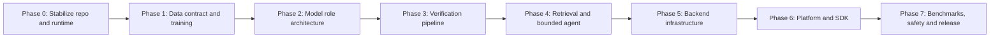

# Argus — Implementation Plan

**Status:** implementation roadmap  
**Scope:** Argus platform, Python verification engine, `@argus/sdk`, and SDK showcase  
**Source of truth:** V1–V4 product documents, `ARCHITECTURE.md`, `UI_Plan.md`, and `Argus_Model_Swap_Architecture.md`

## Outcome

Deliver a locally runnable, evidence-first verification platform with two Next.js 16 applications:

1. **Argus Platform** — organizations, API keys, evidence ingestion, verification history, and explainable verdicts.
2. **SDK Showcase** — a separate application that verifies content exclusively through `@argus/sdk` and the public Argus API.

The backend must produce grounded claims, evidence citations, calibrated confidence, uncertainty/abstention, model provenance, and bounded agent traces. Synthetic artifacts are allowed only as a development fallback; the release evaluation uses real benchmark data and real model outputs.

## Delivery principles

- Keep the current V1–V4 multi-signal architecture: SEP, semantic entropy, kernel language entropy (KLE), retrieval/NLI grounding, learned fusion, and conformal prediction.
- Treat every model as a swappable role, never as a hard-coded provider.
- Keep laptop execution practical for 16 GB RAM / RTX 4050-class hardware; use quantized local models or a remote provider for larger roles.
- Never present synthetic metrics or artifacts as benchmark-validated results.
- Every phase includes code, tests, documentation, and an executable acceptance check.

## Workstream map



## Phase 0 — Stabilize the repository and local runtime

**Goal:** establish one reliable development path before adding further features.

### Tasks

1. Repair the Python 3.12 environment and record the exact creation command in `README.md`.
2. Install the verification-engine dependencies and run its import/health checks.
3. Confirm Docker Desktop can start PostgreSQL, Qdrant, and the verification engine.
4. Apply Prisma migrations against local PostgreSQL.
5. Consolidate the duplicated application scaffolds:
   - make `frontend/platform` the canonical platform application;
   - make `frontend/showcase` the canonical showcase application;
   - archive or remove only after review the older duplicate `apps/platform` and `apps/showcase` implementations;
   - ensure each workspace has a unique package name.
6. Remove temporary build suppressions such as `typescript.ignoreBuildErrors` after resolving type errors.
7. Add root commands for linting, type checking, tests, database migration, local services, and training.

### Acceptance checks

- `docker compose up` reports healthy PostgreSQL, Qdrant, and engine containers.
- `GET /health` returns a structured healthy response.
- Platform and showcase both build with Next.js 16 without skipped TypeScript errors.
- Prisma migration and seed command complete successfully.

## Phase 1 — Dataset contract, artifact training, and proof notebook

**Goal:** make the supplied dataset reproducible and correctly labelled as synthetic proof data.

### Tasks

1. Create a canonical feature schema shared by all training and inference code:

   ```text
   claim_id, sep_score, semantic_entropy, kernel_entropy,
   retrieval_score, nli_grounding, label, split, model_id
   ```

2. Add a dataset-normalization command that converts the supplied fusion CSV into canonical JSONL/Parquet splits.
3. Update `train_real_artifacts.py` so its input schema matches the canonical contract rather than an obsolete hard-coded schema.
4. Train and version the following **synthetic-development** artifacts:
   - fusion classifier/regressor;
   - conformal calibration artifact from a held-out calibration split;
   - SEP probe from the supplied synthetic hidden-state vectors.
5. Generate a model card for each artifact: dataset identity, split, feature shape, metrics, limitations, checksum, and training command.
6. Create an `.ipynb` proof notebook that loads data, trains/evaluates all three artifacts, produces calibration/coverage plots, and saves a reproducibility report.
7. Add tests that reject incompatible vector dimensions and missing required feature columns.

### Important limitation

The supplied SEP vectors are 8-dimensional synthetic inputs. They prove the training/inference contract only. A deployable SEP artifact requires hidden states extracted from the configured generator model and must be retrained for each base model/version.

### Acceptance checks

- One command creates versioned artifacts under `artifacts/` without overwriting previous versions.
- The notebook runs end-to-end from a clean environment.
- Engine can load the generated synthetic artifacts and returns their version IDs in a verdict.
- Documentation clearly labels these artifacts as synthetic-development only.

## Phase 2 — Model-swap architecture and providers

**Goal:** implement the role-based architecture specified in `Argus_Model_Swap_Architecture.md`.

### Tasks

1. Add a central model registry/configuration module with these roles:
   - `embedding`
   - `nli`
   - `small_generator`
   - `large_generator`
   - `ensemble_generator`
   - `judge`
   - `reranker`
2. Add profiles:
   - `laptop`: BGE/E5 embeddings, DeBERTa MNLI, Qwen 1.5B–3B or Llama 3.2 3B in a local/quantized provider;
   - `remote`: API-backed ensemble/judge models;
   - `production`: vLLM-backed local/server inference with explicit GPU settings.
3. Define provider interfaces for Transformers, llama.cpp/Ollama-compatible local inference, vLLM/OpenAI-compatible endpoints, and optional external APIs.
4. Implement health and capability discovery: model name, revision, embedding dimension, context limit, quantization, device, and availability.
5. Add model provenance to every verification record and artifact compatibility validation at service startup.
6. Implement sampled generation with bounded token/cost/time budgets.

### Acceptance checks

- Switching only environment configuration changes the provider/profile; pipeline code remains unchanged.
- A startup check refuses an SEP artifact incompatible with the active generator model or hidden-state dimension.
- `/health` reports active roles and unavailable optional roles without exposing secrets.

## Phase 3 — Real multi-signal verification pipeline

**Goal:** replace placeholders with the V1–V4 verification signals.

### Tasks

1. **Claim decomposition:** split input into independently checkable claims with source offsets.
2. **L1 SEP:** extract real generator hidden states, apply model-specific SEP probes, and return per-claim score plus artifact version.
3. **L2 semantic entropy:** generate multiple bounded samples, embed responses, cluster semantically equivalent answers, and calculate entropy.
4. **L3 KLE:** calculate language/kernel disagreement from sampled output representations according to the documented kernel configuration.
5. **L4 retrieval and NLI:** retrieve evidence, rerank it, run DeBERTa MNLI entailment/contradiction/neutral scoring, and map this to groundedness.
6. **Fusion:** apply the trained fusion artifact to normalized L1–L4 features.
7. **Conformal prediction:** calculate prediction set, coverage target, abstention decision, and reason codes.
8. Define a stable verdict contract with claim-level evidence, scores, labels, uncertainty, provenance, latency, and trace ID.
9. Add deterministic test fixtures for supported, contradicted, insufficient-evidence, and abstained claims.

### Acceptance checks

- One API call returns explainable per-claim verdicts, not merely an aggregate score.
- Inference never silently substitutes a synthetic score when a required real signal is unavailable; it returns a degraded/abstained state with reasons.
- Same input/profile/artifact versions can be replayed from the stored trace.

## Phase 4 — Evidence ingestion, hybrid retrieval, and bounded agents

**Goal:** produce defensible evidence chains rather than model-only judgements.

### Tasks

1. Finish document ingestion: file/URL metadata, chunking strategy/version, embedding, deduplication, status, failure reason, and Qdrant vector ID persistence.
2. Implement hybrid retrieval:
   - dense vector retrieval;
   - BM25 lexical retrieval;
   - reciprocal-rank fusion;
   - cross-encoder reranking;
   - citation/span extraction.
3. Complete LangGraph orchestration around the existing bounded evidence agent:
   - fixed maximum hops, documents, tool calls, tokens, and wall time;
   - explicit state machine and stop reasons;
   - no autonomous web searching unless a source connector is deliberately enabled.
4. Persist agent traces, evidence selections, tool calls, budgets, and final decision rationale.
5. Add source trust/policy controls and organization-level evidence isolation.

### Acceptance checks

- Ingested content is retrievable only by its owning organization.
- Returned citations identify document, chunk, source span, retrieval score, rerank score, and NLI relation.
- Agent execution always terminates within configured bounds and records why it stopped.

## Phase 5 — Backend, database, security, and operations

**Goal:** make the system operable beyond a local demonstration.

### Tasks

1. Complete FastAPI contracts with request validation, versioned schemas, structured errors, pagination, and OpenAPI examples.
2. Complete PostgreSQL persistence for organizations, API keys, documents, chunks, jobs, sessions, claims, evidence, model runs, artifacts, and agent traces.
3. Add API-key hashing, key rotation/revocation, organization scoping, quotas, rate limits, and request IDs.
4. Add asynchronous ingestion/jobs with retry policy and idempotency keys.
5. Add structured logging, metrics, traces, model latency/GPU memory metrics, and health/readiness checks.
6. Add backup/migration runbooks, secret management guidance, CORS policy, upload limits, retention controls, and audit logging.
7. Write integration tests using disposable PostgreSQL/Qdrant services.

### Acceptance checks

- Unauthorized and cross-organization requests are rejected.
- Retrying a request with the same idempotency key does not duplicate an ingestion/job.
- API, database, and vector store can be started from documented Docker commands.

## Phase 6 — Platform, SDK, and showcase applications

**Goal:** ship the two-app experience promised in the UI plan.

### Tasks

1. Finish the **Argus Platform** (Next.js 16): authentication, onboarding, organization switcher, API key management, evidence source upload/status, verification composer, result detail, history, and settings.
2. Connect every platform action to the live backend; remove mock or duplicate verification paths.
3. Make claim details visual: supporting/contradicting evidence, L1–L4 scores, fusion/confidence, conformal set, abstention reasons, and model/version provenance.
4. Finish `@argus/sdk`:
   - typed public request/response contracts;
   - browser/server-safe client separation;
   - retries, timeouts, idempotency keys, streaming/polling support;
   - error classes and examples;
   - generated/reference API documentation.
5. Finish the **SDK Showcase** as a separate Next.js 16 app that imports `@argus/sdk` and uses an API key/environment configuration—no internal engine imports.
6. Add end-to-end browser tests for a new user: sign in, ingest evidence, verify a claim, view cited result, create key, and run the showcase.

### Acceptance checks

- Platform and showcase run independently and use distinct package names.
- The showcase exercises the same public API and SDK that an external developer receives.
- A user can trace a dashboard verdict to stored API request, evidence, models, and artifacts.

## Phase 7 — Real data evaluation, release gates, and ongoing operations

**Goal:** validate the differentiated V1–V4 claims with honest, reproducible evidence.

### Tasks

1. Add licensed/downloaded dataset adapters and provenance records for TruthfulQA, HaluEval, and SelfCheckGPT.
2. Produce real hidden-state SEP training data from the selected generator model/profile.
3. Train SEP, fusion, and conformal artifacts using proper train/calibration/test separation. Prevent benchmark leakage.
4. Run ablations for each signal and report accuracy/F1/AUROC, expected calibration error, Brier score, conformal coverage/set size, abstention rate, latency, cost, and memory.
5. Compare against clear baselines: retrieval-only, NLI-only, semantic-entropy-only, and fusion without conformal prediction.
6. Create model cards, dataset cards, benchmark reports, risk limitations, and release sign-off checklist.
7. Establish artifact registry/versioning, rollback procedure, drift monitoring, periodic recalibration, and retraining triggers.

### Release gates

- No synthetic artifacts are configured as production defaults.
- All production artifacts declare compatible generator/embedding/NLI versions.
- Benchmark report is reproducible from pinned data revisions and commands.
- Security, tenancy, privacy, performance, and failure-mode checks pass.

## Recommended execution order

| Order | Deliverable | Why it comes now |
| --- | --- | --- |
| 1 | Phase 0 runtime and repo stabilization | All implementation and testing depends on it. |
| 2 | Phase 1 supplied-dataset pipeline | Produces a testable artifact contract immediately. |
| 3 | Phase 2 model registry | Prevents model/provider lock-in before real model work. |
| 4 | Phase 3 signals and Phase 4 retrieval | Creates the core Argus differentiation. |
| 5 | Phase 5 persistence/security | Makes core behavior usable by real organizations. |
| 6 | Phase 6 product/SDK/showcase | Delivers the promised external experience. |
| 7 | Phase 7 real benchmarks/release | Validates claims before calling the system production-ready. |

## Definition of done

Argus is complete when both Next.js 16 apps work against the same secured, Docker-runnable backend; the SDK is the sole integration path used by the showcase; every claim verdict carries evidence, calibrated uncertainty, model/artifact provenance, and bounded-agent trace; and the final metrics are generated from real, documented benchmarks rather than synthetic data.

## Documentation deliverables

Update these documents alongside the relevant work; do not leave implementation knowledge only in code:

- `README.md` — one-command setup and architecture entry point.
- `DEVELOPMENT_LOG.md` — dated implementation decisions and validation results.
- `BACKEND.md` and `DATABASE.md` — API/data changes and migrations.
- `SYNTHETIC_ARTIFACTS.md` — synthetic artifact boundaries and replacement status.
- `Argus_Model_Swap_Architecture.md` — active profiles/providers and compatibility matrix.
- `VISION_ALIGNMENT_AND_REMAINING_WORK.md` — phase completion status and any intentional changes to V1–V4.
- `CODEBASE_INDEX.md` — update after structural changes.
